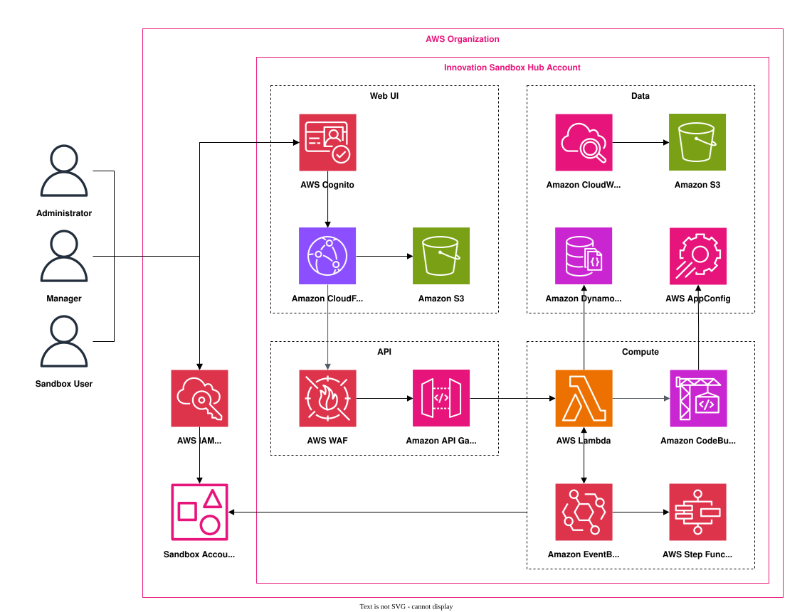

# Innovation Sandbox on AWS

**[🚀 Solution Landing Page](https://aws.amazon.com/solutions/implementations/innovation-sandbox-on-aws)** | **[🚧 Feature request](https://github.com/aws-solutions/innovation-sandbox-on-aws/issues/new?assignees=&labels=enhancement&template=feature_request.md&title=)** | **[🐛 Bug Report](https://github.com/aws-solutions/innovation-sandbox-on-aws/issues/new?assignees=&labels=bug&template=bug_report.md&title=)**

**Note:** If you want to use the solution without building from source, navigate to Solution Landing Page.

## Table of Contents

- [Table of Contents](#table-of-contents)
- [Solution Overview](#solution-overview)
- [Architecture](#architecture)
- [Prerequisites](#prerequisites)
- [Environment Variables](#environment-variables)
- [Deploy the Solution](#deploy-the-solution)
  - [Deployment Prerequisites](#deployment-prerequisites)
  - [Deploy from the AWS Console](#deploy-from-the-aws-console)
  - [Deploy from Source](#deploy-from-source)
  - [Post Deployment Tasks](#post-deployment-tasks)
- [Scripts](#scripts)
- [Running Tests](#running-tests)
  - [Unit Tests](#unit-tests)
- [Using Private ECR Repository](#using-private-ecr-repository)
- [Uninstalling the Solution](#uninstalling-the-solution)
- [Cost Scaling](#cost-scaling)
- [File Structure](#file-structure)
- [Pre-Commit](#pre-commit)
- [Collection of Operational Metrics](#collection-of-operational-metrics)
- [License](#license)
- [Additional Resources](#additional-resources)

## Solution Overview

Innovation Sandbox on AWS enables cloud administrators to provision and recycle temporary AWS sandbox environments with automated security, governance, and cost management. Teams can experiment, learn, and innovate with AWS services in production-isolated accounts that are automatically cleaned up and returned to the pool after use.

The solution provides a self-service web UI and API for requesting time-bound sandbox leases, configuring lease templates with budget and duration controls, sharing accounts across teams, deploying pre-configured infrastructure via blueprints, and monitoring costs through native AWS billing integration. Administrators manage all settings, including Service Control Policies, cleanup behavior, and notifications, directly from the application.

To find out more about Innovation Sandbox on AWS visit our [AWS Solutions](https://aws.amazon.com/solutions/implementations/innovation-sandbox-on-aws)
page.

## Architecture



For more details, please refer to the [Architecture Overview](https://docs.aws.amazon.com/solutions/latest/innovation-sandbox-on-aws/architecture-overview.html#architecture-diagram) section of the implementation guide.

## Prerequisites

In order to test, build, and deploy the solution from source the following prerequisites will be required for your development environment:

- MacOS or Amazon Linux 2023 Operating System
- Cloned Repository
- Node 24
- Python (Optional)
- Pre-Commit (Optional)
- Docker (Optional)

Once your development environment meets the minimum requirements install the necessary dependencies, navigate to the root of the repository and run:

```shell
npm install
```

> **Note:** Many of the commands in this file expect you to have appropriate AWS CLI access to the target accounts configured. If you have a multi-account deployment you will need to switch between account credentials to perform the commands on the appropriate accounts.

## Environment Variables

Before you start working from the Innovation Sandbox on AWS repository you must first configure your environment. Use the following command to generate a `.env` file to begin:

```shell
npm run env:init
```

In the `.env` file configure the required values. The file provides comments as to what each environment variable does. The optional ones are not required to deploy the solution.

## Deploy the Solution

### Deployment Prerequisites

The solution requires several prerequisite steps before attempting to deploy the solution. See the [implementation guide](https://docs.aws.amazon.com/solutions/latest/innovation-sandbox-on-aws/prerequisites.html) for more details.

### Deploy from the AWS Console

| Stack        |                                                                                                          CloudFormation Launch Link                                                                                                           |                                                         S3 Download Link                                                         |
| ------------ | :-------------------------------------------------------------------------------------------------------------------------------------------------------------------------------------------------------------------------------------------: | :------------------------------------------------------------------------------------------------------------------------------: |
| Account Pool | [Launch](https://console.aws.amazon.com/cloudformation/home?region=us-east-1#/stacks/new?&templateURL=https://solutions-reference.s3.amazonaws.com/innovation-sandbox-on-aws/latest/InnovationSandbox-AccountPool.template&redirectId=GitHub) | [Download](https://solutions-reference.s3.amazonaws.com/innovation-sandbox-on-aws/latest/InnovationSandbox-AccountPool.template) |
| IDC          |     [Launch](https://console.aws.amazon.com/cloudformation/home?region=us-east-1#/stacks/new?&templateURL=https://solutions-reference.s3.amazonaws.com/innovation-sandbox-on-aws/latest/InnovationSandbox-IDC.template&redirectId=GitHub)     |     [Download](https://solutions-reference.s3.amazonaws.com/innovation-sandbox-on-aws/latest/InnovationSandbox-IDC.template)     |
| Data         |    [Launch](https://console.aws.amazon.com/cloudformation/home?region=us-east-1#/stacks/new?&templateURL=https://solutions-reference.s3.amazonaws.com/innovation-sandbox-on-aws/latest/InnovationSandbox-Data.template&redirectId=GitHub)     |    [Download](https://solutions-reference.s3.amazonaws.com/innovation-sandbox-on-aws/latest/InnovationSandbox-Data.template)     |
| Compute      |   [Launch](https://console.aws.amazon.com/cloudformation/home?region=us-east-1#/stacks/new?&templateURL=https://solutions-reference.s3.amazonaws.com/innovation-sandbox-on-aws/latest/InnovationSandbox-Compute.template&redirectId=GitHub)   |   [Download](https://solutions-reference.s3.amazonaws.com/innovation-sandbox-on-aws/latest/InnovationSandbox-Compute.template)   |

### Deploy from Source

Deploying the solution from source uses AWS CDK to do so. If you have not already you will need to bootstrap the target accounts with the following command:

```shell
npm run bootstrap
```

To deploy the solution into a single account, run the following command from the repository root:

```shell
npm run deploy:all
```

To deploy the individual cloudformation stacks for a multi-account deployment, use the following commands for each of the stacks:

```shell
npm run deploy:account-pool
npm run deploy:idc
npm run deploy:data
npm run deploy:compute
```

### Post Deployment Tasks

Before the solution is fully functional the post deployment tasks must be completed. See the [implementation guide](https://docs.aws.amazon.com/solutions/latest/innovation-sandbox-on-aws/post-deployment-configuration-tasks.html) for more details.

## Scripts

- [M2M Authentication Scripts](./scripts/m2m/README.md) — CLI tools for deploying per-client M2M roles, assuming them, and signing API requests with SigV4.

## Running Tests

### Unit Tests

To run unit tests for all packages in the solution, run the following command from the repository root:

```shell
npm test
```

To also update snapshot tests run the following command from the repository root:

```shell
npm run test:update-snapshots
```

## Using Private ECR Repository

For development purposes it may be useful to use a custom ECR image to test updates to AWS Nuke or just host the image in your account.

> **Note:** Make sure you have the docker engine installed and running on your machine to perform the steps in this section.

Follow these steps to configure deployment to use a private ECR image:

1. In the account and region the compute stack is deployed into, create a new private ecr repository. You can name it whatever you like but we suggest something like `innovation-sandbox`.
1. Configure your `.env` file with the `PRIVATE_ECR_REPO` and `PRIVATE_ECR_REPO_REGION` environment variables. This should be the region and name for the private repo you just created.
1. From the root of the innovation sandbox repo run the following command:
   ```shell
   npm run docker:build-and-push
   ```
   This will build the dockerfile located at `source/infrastructure/lib/components/account-cleaner/image/Dockerfile` and push it to the ECR repo configured in your .env file.
1. If you have already deployed the solution you will need to deploy the compute stack again to have the solution use the private ecr repo. To do that run the following command:
   ```shell
   npm run deploy:compute
   ```

## Uninstalling the Solution

To uninstall the solution, run the following command from the repository root:

```shell
npm run destroy:all
```

If you had used a multi-account deployment or only want to destroy certain stacks you can use the following commands:

```shell
npm run destroy:account-pool
npm run destroy:idc
npm run destroy:data
npm run destroy:compute
```

## Cost Scaling

This solution incurs cost for both the solution infrastructure and any activity that occurs within the sandbox accounts. Cost will vary greatly based on sandbox account usage.

For more details on solution infrastructure cost estimation see the [implementation guide](https://docs.aws.amazon.com/solutions/latest/innovation-sandbox-on-aws/cost.html).

## File Structure

```
root
├── deployment/                     # shell scripts to generate native cloudformation distributables
│   ├── global-s3-assets                # generated dist files for cdk synthesized cloudformation templates
│   ├── regional-s3-assets              # generated dist files for zipped runtime assets such as lambda functions
│   └── build-s3-dist.sh                # builds solution into distributable assets that can be deployed with cloudformation
├── docs/                           # architecture diagrams and API specifications
├── scripts/                        # utility and deployment scripts
│   ├── cdk/                            # CDK bootstrap, deploy, and destroy wrappers
│   └── m2m/                            # M2M authentication helper scripts
├── source/                         # source code separated into multiple stand alone packages
│   ├── common                          # common libraries used across the solution
│   ├── frontend                        # frontend vite application
│   ├── infrastructure                  # cdk application consisting of solution infrastructure
│   ├── lambdas                         # lambda function runtime code, contains multiple lambdas each of which is its own package
│   └── layers                          # lambda layers, contains multiple layers each of which is its own package
├── .pre-commit-config.yaml         # pre-commit hook configurations
└── package.json                    # top level npm package.json file with scripts to serve as orchestrated monorepo commands
```

## Pre-Commit

This repository uses pre-commit. Pre-commit is a framework for managing and maintaining multi-language pre-commit hooks which are scripts that run every time you make a commit. This offers automated checks with quick feedback cycles that enable code reviewers to focus on architecture and design rather than syntax and style.

To install the hooks, run the following commands:

```shell
# this installs the pre-commit package manager
pip install pre-commit
```

```shell
# this will install the hook scripts contained in the .pre-commit-config.yaml file
pre-commit install
```

Once installed pre-commit hooks will be ran on each commit preventing commits that do not pass the configured checks. Certain hooks will automatically alter and reformat code so that you don't have to.

If you would like to run the hooks without making a commit, run the following command.

```shell
pre-commit run --all-files
```

For more information on pre-commit, refer to the official documentation [here](https://pre-commit.com/).

## Collection of Operational Metrics

This solution sends operational metrics to AWS (the “Data”) about the use of this solution. We use this Data to better understand how customers use this solution and related services and products. AWS’s collection of this Data is subject to the [AWS Privacy Notice](https://aws.amazon.com/privacy/).

## License

Copyright Amazon.com, Inc. or its affiliates. All Rights Reserved.

Licensed under the Apache License Version 2.0 (the "License"). You may not use this file except
in compliance with the License. A copy of the License is located at http://www.apache.org/licenses/
or in the "[LICENSE](./LICENSE)" file accompanying this file. This file is distributed on an "AS IS" BASIS,
WITHOUT WARRANTIES OR CONDITIONS OF ANY KIND, express or implied. See the License for the
specific language governing permissions and limitations under the License.

## Additional Resources

- [AWS Solutions Library](https://aws.amazon.com/solutions/)
- [AWS CloudFormation Documentation](https://docs.aws.amazon.com/AWSCloudFormation/latest/UserGuide/Welcome.html)
- [AWS CloudFormation StackSets Documentation](https://docs.aws.amazon.com/AWSCloudFormation/latest/UserGuide/what-is-cfnstacksets.html)
- [AWS CDK Documentation](https://docs.aws.amazon.com/cdk/v2/guide/home.html)
- [AWS Account Management](https://docs.aws.amazon.com/accounts/latest/reference/accounts-welcome.html)
- [AWS Nuke Repository](https://github.com/ekristen/aws-nuke)
